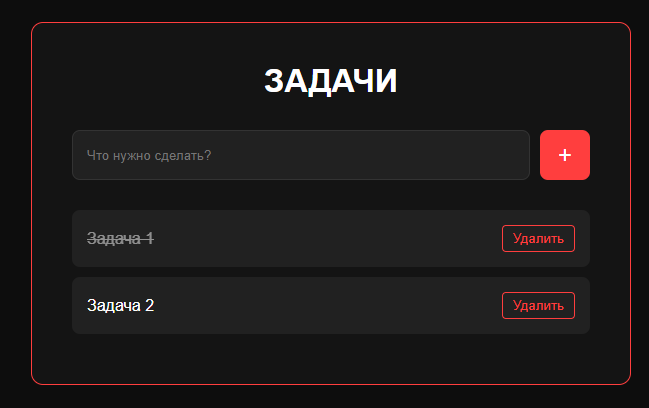

# Task Manager



## Структура
- **Backend:** Golang (стандартная библиотека + драйвер pq)
- **Database:** PostgreSQL
- **Frontend:** Интерфейс (HTML/CSS/JS) с функцией добавления, зачёркивания и удаления задач
- **Infrastructure:** Контейнеризация через Docker Compose
- **Resilience:** Механизм ожидания готовности БД при запуске

## Стек технологий
- **Язык:** Go 1.21
- **База данных:** PostgreSQL 15 (Alpine Linux)
- **Среда:** Docker / Docker Compose
- **Frontend:** Vanilla JS, CSS Variables

## Запуск
1. Должна быть установлена программа **Docker Desktop**
```text
https://docs.docker.com/get-started/get-docker/
```
2. Клонировать репозиторий
```Powershell
git clone https://github.com/qsemyon/task-manager-golang
cd task-manager-golang
```
3. Запуск проекта
```PowerShell
docker-compose up --build
```
4. Открыть порт в браузере
```Text
http://localhost:8080
```

## Принцип работы
Проект разделен на два изолированных контейнера (App и DB), работающих в одной сети

### CRUD
- GET /tasks - получение списка
- POST /tasks - создание новой задачи
- PUT /tasks - переключение статуса (зачеркивание)
- DELETE /tasks - удаление