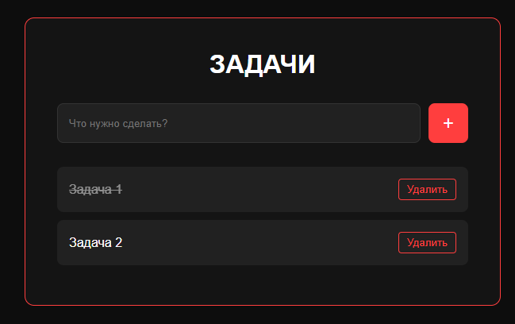

# Task Management



Облачно-ориентированное веб-приложение для управления задачами. Проект построен на разделении ответственности между Go-бэкендом и TypeScript-фронтендом, обеспечивая высокую производительность и масштабируемость

## Технологический стек

### Backend
* **Язык:** Go 1.26.1 (стандартная библиотека `net/http`)
* **Драйвер БД:** `github.com/lib/pq`
* **Конфигурация:** Переменные окружения (`os.Getenv`)

### Frontend
* **Среда выполнения:** Node.js 20+
* **Инструментарий:** Vite + TypeScript
* **Стилизация:** Современный CSS (Variables, Flexbox/Grid)

### Инфраструктура
* **СУБД:** PostgreSQL 15 (Alpine-based image)
* **Оркестрация:** Docker Compose
* **Сборка:** Multi-stage Dockerfile (оптимизация размера итогового образа)

## Архитектурные особенности

* **Отказоустойчивость:** Реализован механизм повторных попыток подключения к базе данных (Retry Logic) с проверкой готовности через `Healthcheck`
* **Безопасность:** Полная изоляция чувствительных данных. Настройки передаются исключительно через переменные окружения
* **Оптимизация:** Статические файлы фронтенда компилируются в оптимизированный bundle и раздаются Go-сервером из единого бинарного файла

## Инструкция по развертыванию

### 1. Конфигурация среды
Для корректной работы системы необходимо создать файл `.env` в корневой директории проекта:

```env
DB_USER=postgres
DB_PASSWORD=password
DB_NAME=database
DB_HOST=db
DB_PORT=5432
APP_PORT=8080
```

### 2. Запуск системы
Развертывание всех компонентов осуществляется одной командой:
```Bash
docker-compose up --build
```
После завершения процесса сборки интерфейс будет доступен по адресу: `http://localhost:8080`

---

## Спецификация API (REST)

| Метод | Путь | Описание |
| :--- | :--- | :--- |
| `GET` | `/tasks` | Извлечение полного списка задач из базы данных |
| `POST` | `/tasks` | Создание новой записи (ожидает JSON-объект) |
| `PUT` | `/tasks?id={id}` | Переключение статуса выполнения задачи |
| `DELETE` | `/tasks?id={id}` | Безвозвратное удаление записи из системы |

## Структура репозитория
- /frontend - Исходный код клиентской части (TS/Vite)
- main.go - Точка входа серверной части и реализация API
- Dockerfile - Многоэтапный сценарий сборки проекта
- docker-compose.yml - Описание сетевого взаимодействия и параметров контейнеров
- .gitignore - Список исключений для системы контроля версий (включая .env)